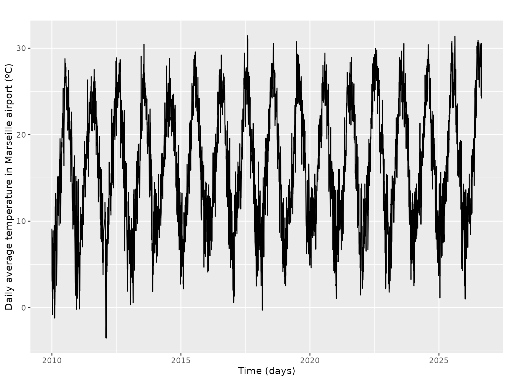
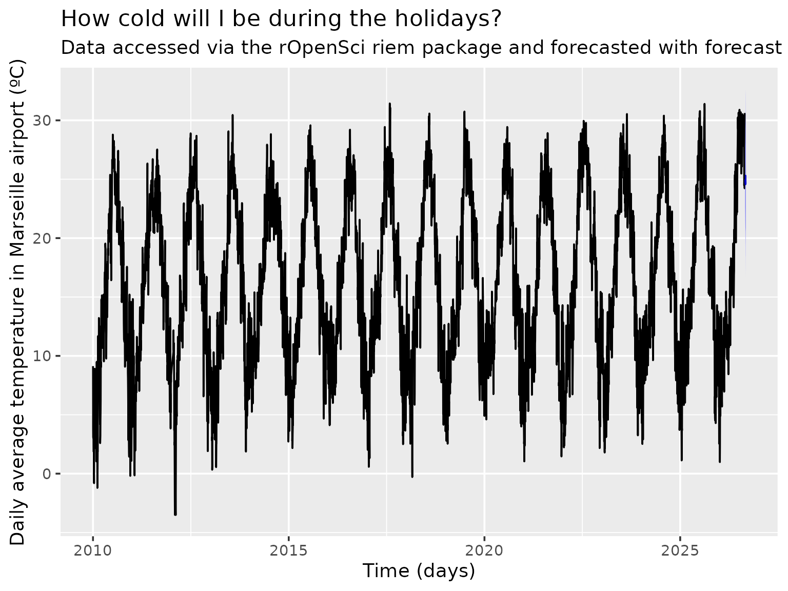
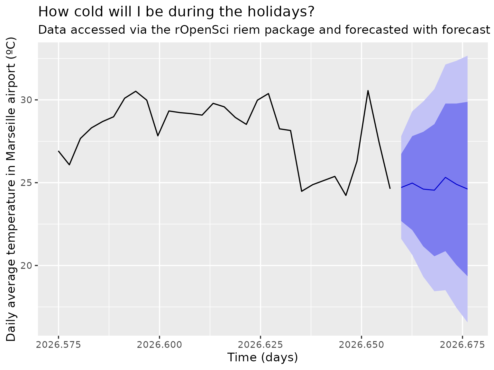
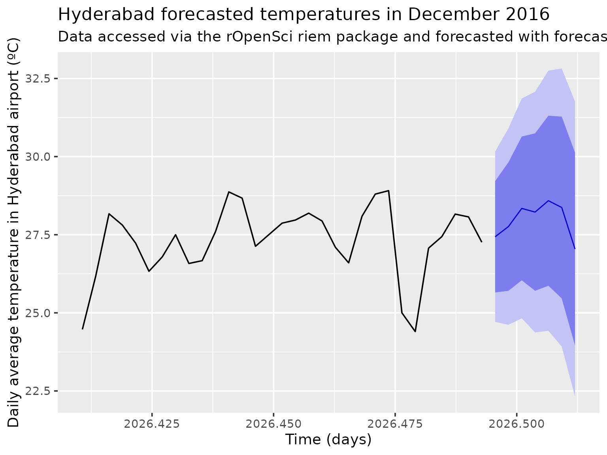

# Forecasting temperature at your vacation destination

For Christmas I’ll travel to Marseille. What temperatures should I
expect there? I could of course open a weather app, but in this vignette
I want to give an example using the `riem` and `forecast` packages.

## Find airport for Marseille

The name of the network for France is “FR\_\_ASOS”. I already know
there’s only one airport near the city.

``` r

library("riem")
library("dplyr")
france_airports <- riem_stations(network = "FR__ASOS")
marseilles_airport <- filter(france_airports, grepl("MARSEILLE", name) | grepl("Marseille", name))
marseilles_airport
```

    ## # A tibble: 1 × 22
    ##   index id    synop name  country elevation network online plot_name archive_end
    ##   <int> <chr> <dbl> <chr> <chr>       <dbl> <chr>   <lgl>  <chr>     <chr>      
    ## 1    71 LFML  99999 Mars… FR             36 FR__AS… TRUE   MARSEILL… NA         
    ## # ℹ 12 more variables: modified <chr>, spri <int>, tzname <chr>, iemid <int>,
    ## #   archive_begin <chr>, metasite <lgl>, wigos <chr>, longitude <dbl>,
    ## #   latitude <dbl>, state <chr>, lon <dbl>, lat <dbl>

## Get time series of temperature for Marseille airport

We’ll transform it to daily average, and convert Fahrenheit to Celsius
thanks to the `weathermetrics` package. We impute the missing values and
remove outliers via the use of
[`forecast::tsclean`](https://pkg.robjhyndman.com/forecast/reference/tsclean.html).

``` r

marseille <- riem_measures(
  station = marseilles_airport$id,
  date_start = "2010 01 01"
)

marseille <- group_by(marseille, day = as.Date(valid))
marseille <- summarize(marseille, temperature = mean(tmpf))
marseille <- mutate(marseille, temperature = weathermetrics::fahrenheit.to.celsius(temperature))
library("ggplot2")


library("forecast")
marseille_ts <- ts(as.vector(tsclean(marseille$temperature)), freq = 365.25, start = c(2010, 1))
autoplot(marseille_ts) +
  ylab("Daily average temperature in Marseille airport (ºC)") +
  xlab("Time (days)")
```



## Forecast for Marseille

For this we use the `forecast` package. We use the `stlm` because our
time series obviously present yearly seasonality.

``` r

fit <- stlm(marseille_ts)
```

    ## Warning in ets(x, model = etsmodel, allow.multiplicative.trend =
    ## allow.multiplicative.trend, : Non-integer seasonal period. Only non-seasonal
    ## models will be considered.

``` r

pred <- forecast(fit, h = 7)
# plot
theme_set(theme_gray(base_size = 14))
autoplot(pred) +
  ylab("Daily average temperature in Marseille airport (ºC)") +
  xlab("Time (days)") +
  ggtitle("How cold will I be during the holidays?",
    subtitle = "Data accessed via the rOpenSci riem package and forecasted with forecast"
  )
```



Mmh I don’t see anything, but `autoplot.forecast` has an `include`
parameters, so I’ll only plot the last 31 values.

``` r

autoplot(pred, include = 31) +
  ylab("Daily average temperature in Marseille airport (ºC)") +
  xlab("Time (days)") +
  ggtitle("How cold will I be during the holidays?",
    subtitle = "Data accessed via the rOpenSci riem package and forecasted with forecast"
  )
```



## What if I went somewhere else?

Ok, what if I had travelled to, say, Hyderabad in India?

    ## Warning in ets(x, model = etsmodel, allow.multiplicative.trend =
    ## allow.multiplicative.trend, : Non-integer seasonal period. Only non-seasonal
    ## models will be considered.



Without surprise, we forecast I’d have enjoyed warmer weather.

I wouldn’t advise you to really use such code to forecast temperature,
but I’d recommend you to use `riem` for getting weather airport data
quite easily and to dig more deeply into `forecast` functionalities if
you’re interested in time series forecasting. And stay warm!
